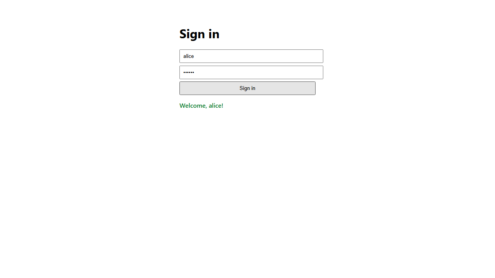

# agentic-qa-lab

[](https://github.com/DiogoRibeiro7/agentic-qa-lab/actions/workflows/ci.yml)


Autonomous UI and game-testing agent using vision-language reasoning, browser control, action planning, failure recovery, and evaluation.

This repository is designed as a portfolio project for founding AI engineer, agentic AI, AI/ML engineer, and applied AI research roles.

## Goal

Build an agent that can interact with a browser-based game or UI workflow. The agent observes state, plans actions, executes clicks or keyboard events, recovers from failure, and produces structured test reports.

## Core capabilities

- Browser automation with Playwright.
- Agent planner with tool-calling interface.
- Optional vision-language model support through screenshot observations.
- Stateful execution loop with retries, timeouts, and recovery policies.
- Evaluation metrics: task success rate, steps to completion, retries, timeout rate, and failure taxonomy.
- FastAPI service and Streamlit dashboard for inspecting test runs.
- Dockerized local execution.

## Suggested implementation stack

- Python 3.11
- Poetry
- Playwright
- FastAPI
- Pydantic
- LangGraph or a custom state machine
- OpenAI-compatible LLM client abstraction
- SQLite/PostgreSQL for trace storage
- MLflow or local JSONL for experiment tracking

## Domain model

The core domain layer (`agentic_qa_lab.domain`) defines the provider- and
environment-agnostic types that flow through every run. They are plain Pydantic
models with strict validation and no I/O, so they serialize cleanly and are easy
to test.

- **`TaskSpec`** — declarative description of a task: goal, `start_url`, an
  optional `success_selector`, and run safeguards (`max_steps`, `max_retries`,
  `timeout_seconds`).
- **`Observation`** — a multimodal snapshot of environment state: URL, title,
  DOM snapshot, optional screenshot path, timestamp, and viewport.
- **`AgentAction`** — the unit of agent intent. Supported `ActionType` values
  are `click`, `type_text`, `press_key`, `wait`, `finish`, and `fail`.
  Cross-field validation enforces that, e.g., `click` has a selector or
  coordinates, `type_text` carries non-empty text, and `wait` has a positive
  duration. `finish`/`fail` are terminal.
- **`ActionResult`** — outcome of executing one action, including a
  `FailureCategory` taxonomy bucket, retry count, and duration.
- **`TraceStep`** — one `(observation, action, result)` tuple.
- **`RunResult`** — aggregated run outcome with a terminal `RunStatus`
  (`success`, `failure`, `timeout`, `max_steps`, `error`), the ordered trace,
  total retries, and timing. Validation keeps the status, failure category, and
  timestamps mutually consistent.

```python
from agentic_qa_lab.domain import AgentAction, TaskSpec

task = TaskSpec(task_id="login", goal="Log in", start_url="https://example.com")
action = AgentAction.type_text("alice", selector="#username")
```

Run the domain tests with `pytest tests/test_domain.py`.

## Browser environment

`agentic_qa_lab.environments` keeps all browser I/O behind the
`BrowserEnvironment` interface so agents only ever speak in domain types.
`PlaywrightEnvironment` is the reference adapter:

- `open(url)` navigates and returns the first `Observation`.
- `observe()` captures URL, title, DOM snapshot, and an optional screenshot.
- `execute(action)` dispatches a `click`, `type_text`, `press_key`, or `wait`
  to Playwright and returns a structured `ActionResult`. Timeouts and missing
  elements are mapped to `FailureCategory` buckets instead of raising.
- It is a context manager, so the browser is always released.

The adapter accepts an injected `page`, which makes it fully unit-testable with
a fake — see `tests/test_environments.py` (no browser binaries required).

```bash
playwright install chromium     # one-time, for real runs
python examples/simple_form_task.py
```

## Agents and the runner

`agentic_qa_lab.agents` separates *deciding* from *doing*. An `Agent` is a pure
function — `next_action(task, observation, trace) -> AgentAction` — that performs
no I/O, so agents are trivial to test and swap.

- **`RuleBasedAgent`** — the deterministic baseline. It replays a fixed action
  plan, finishes early if the task's `success_selector` appears in the DOM, and
  finishes cleanly once the plan is exhausted.
- **`Runner`** — owns the observe → decide → act loop and the safeguards:
  `max_steps`, `max_retries` (failed actions are retried up to the budget), and
  a wall-clock `timeout_seconds`. It returns an aggregated `RunResult` whose
  terminal `RunStatus` is one of `success`, `failure`, `timeout`, `max_steps`,
  or `error`. Agent exceptions are caught and surface as `error` /
  `AGENT_ERROR` rather than crashing the run.
- **`write_trace_jsonl(run, path)`** — persists a run as JSONL: one `step`
  record per trace step plus a final `summary` record.

```python
from agentic_qa_lab.agents import RuleBasedAgent, Runner, write_trace_jsonl
from agentic_qa_lab.domain import AgentAction, TaskSpec

task = TaskSpec(task_id="demo", goal="Submit", start_url="https://example.com/")
agent = RuleBasedAgent([AgentAction.click("#submit"), AgentAction.finish()])
# run = Runner().run(task, agent, env)   # env is any BrowserEnvironment
# write_trace_jsonl(run, "artifacts/demo.jsonl")
```

### Failure modes

- A non-terminal action that keeps failing past `max_retries` ends the run as
  `failure` with the environment's `FailureCategory`.
- Exceeding `max_steps` ends the run as `max_steps`.
- Exceeding `timeout_seconds` ends the run as `timeout`.
- A `finish` action with an unmet `success_selector` is treated as `failure`.

## LLM planner

The planning layer is provider-agnostic. The core depends only on the
`LLMClient` protocol — a single `complete(messages) -> str` call — so any
backend can be plugged in without touching the agent logic.

- **`OpenAICompatibleClient`** — talks to any OpenAI-style
  `/chat/completions` endpoint using only the standard library. It is
  configured entirely through environment variables: `LLM_API_KEY` (required),
  `LLM_BASE_URL` (default `https://api.openai.com/v1`), and `LLM_MODEL`
  (default `gpt-4o-mini`). It supports both plain text completions and
  schema-constrained JSON output via OpenAI `response_format=json_schema`.
- **`LLMPlannerAgent`** — renders the goal, the current observation (URL,
  title, compact page summary, and a short action history into a chat prompt,
  then parses the reply into a strictly-validated `AgentAction`. Instead of
  dumping raw HTML, the prompt prefers visible page text plus a compact summary
  of interactive elements, and it caps history/memory blocks by approximate
  token budget. When the client supports structured completion, the planner
  requests an `AgentAction` through JSON Schema rather than free-text JSON;
  otherwise it falls back to parsing JSON inside plain text / ```json fences.
  Invalid replies trigger a correction re-prompt up to `max_parse_retries`; if
  the model still fails, the agent emits a terminal `fail` so the run ends
  cleanly.

```bash
export LLM_API_KEY=sk-...           # any OpenAI-compatible provider
export LLM_BASE_URL=https://api.openai.com/v1
export LLM_MODEL=gpt-4o-mini
```

```python
from agentic_qa_lab.agents import LLMPlannerAgent, OpenAICompatibleClient

agent = LLMPlannerAgent(OpenAICompatibleClient())
# run = Runner().run(task, agent, env)
```

## Evaluation benchmark

`agentic_qa_lab.evaluation` turns runs into comparable numbers.

- **Task files** (YAML or JSON) under `tasks/` describe a `TaskSpec` plus an
  optional `plan` — the action list the rule-based baseline replays. `load_cases`
  expands globs internally (so it works in PowerShell too), de-duplicates, and
  sorts by `task_id`.
- **`BenchmarkRunner`** runs every case with a fresh agent and environment
  (built by injected factories) and returns one `RunResult` per task.
- **`compute_summary`** reports success rate, mean/median steps, total retries,
  timeout rate, and a per-`FailureCategory` breakdown.
- **`export_results`** writes `benchmark_summary.csv` (one row per run) and
  `benchmark_summary.json` (summary + per-run detail).

Run a **single task** end-to-end, or a whole **benchmark**, from the CLI:

```bash
playwright install chromium

# One task with the rule-based baseline; writes artifacts/runs/<task_id>.jsonl
agentic-qa run --task tasks/example_login.yaml

# One task with the LLM planner, combined grounding, and the repair loop
agentic-qa run --task tasks/example_login.yaml --agent llm --mode combined --reflect

# Batch benchmark with summary CSV/JSON
agentic-qa benchmark --tasks "tasks/*.yaml" --tasks "tasks/*.json" --out-dir artifacts/benchmark

# Run two benchmark cases at a time
agentic-qa benchmark --tasks "tasks/real/*.yaml" --workers 2
```

`run` exits non-zero when the task does not succeed, so it composes in scripts
and CI. `--agent` selects `rule` or `llm`; `--mode` sets the LLM grounding
channel; `--reflect` wraps the agent in the repair loop (and lets failed actions
stay in the trace for recovery).

(The console-script `agentic-qa` is registered via `pyproject.toml`; without an
install, use `python -m agentic_qa_lab.cli benchmark ...`.)

### Real-site tasks

Beyond the illustrative `tasks/*` files, [`tasks/real/`](tasks/real/) holds
benchmark tasks against a real, public automation-practice site
([the-internet.herokuapp.com](https://the-internet.herokuapp.com)) with
verified selectors and success markers:

| Task | What it does |
| ---- | ------------ |
| `herokuapp-login` | Fills the login form and reaches the secure area |
| `herokuapp-login-logout` | Logs in, then logs back out (multi-page workflow) |
| `herokuapp-redirect` | Navigates from the index to the redirect page |

```bash
agentic-qa benchmark --tasks "tasks/real/*.yaml" --tasks "tasks/real/*.json"
```

These need network access and Chromium. Their shape is always validated in the
test suite; the live runs are opt-in via
[`tests/test_real_tasks.py`](tests/test_real_tasks.py) — set
`AGENTIC_QA_RUN_NETWORK_TESTS=1` (with Chromium installed) to execute them,
otherwise they skip so CI stays green.

## API and dashboard

A small web tier makes runs inspectable. By design the API ingests *completed*
runs (the `Runner`/benchmark produce them) rather than launching browsers
itself, so the web tier is stateless and browser-free.

**FastAPI service** (`agentic_qa_lab.api`):

| Method & path            | Purpose                          |
| ------------------------ | -------------------------------- |
| `GET  /health`           | liveness probe                   |
| `POST /runs`             | store a `RunResult`, returns id  |
| `GET  /runs`             | list run summaries               |
| `GET  /runs/{id}`        | full `RunResult`                 |
| `GET  /runs/{id}/trace`  | trace steps for a run            |

Runs are persisted as one JSON file per run under `AGENTIC_QA_STORE_DIR`
(default `artifacts/runs`).

**Streamlit dashboard** (`apps/dashboard/app.py`) reads the API
(`AGENTIC_QA_API_URL`) and offers a run-comparison table with a success-rate
metric and a per-step trace viewer.

```bash
uvicorn agentic_qa_lab.api.app:app --reload          # API on :8000
streamlit run apps/dashboard/app.py                  # dashboard on :8501
# or both, with a shared storage volume:
docker compose up --build                            # api :8000, dashboard :8501
```

Dashboard screenshots live in [docs/](docs/) once you have run the stack and
captured them (`docs/dashboard_comparison.png`, `docs/dashboard_trace.png`).

## Vision-language reasoning

Observations are multimodal, so the planner can ground on pixels as well as
markup. `PlaywrightEnvironment` already writes a screenshot per step (set
`screenshot_dir`), and the LLM layer attaches images via the OpenAI multimodal
`content` format — an `LLMMessage` simply carries `images=(path, ...)`.

`LLMPlannerAgent(observation_mode=...)` selects the grounding channel:

- `ObservationMode.DOM_ONLY` — serialized DOM, no image (default).
- `ObservationMode.SCREENSHOT_ONLY` — screenshot attached, DOM omitted; the
  system prompt gains a visual-reasoning instruction.
- `ObservationMode.COMBINED` — both; reconcile DOM selectors with the layout.

```python
from agentic_qa_lab.agents import LLMPlannerAgent, ObservationMode, OpenAICompatibleClient

agent = LLMPlannerAgent(
    OpenAICompatibleClient(),
    observation_mode=ObservationMode.COMBINED,
)
```

[`notebooks/vision_observation_modes.ipynb`](notebooks/vision_observation_modes.ipynb)
compares the three modes on a toy benchmark with an offline mock VLM and
analyzes where each fails: DOM-only misses wordless/canvas widgets,
screenshot-only misreads exact field values, and combined covers both at a
higher per-step token cost. Regenerate it with
`python auxiliar/make_vision_notebook.py`.

## Self-reflection and repair

`ReflectiveAgent` wraps any agent and adds a bounded recovery policy: when the
inner agent re-proposes an action that just failed, it inserts a single settle
`wait` and lets it retry; if the same action keeps failing past `max_attempts`,
it stops with a terminal `fail` instead of looping. The policy is deterministic
and inner-agent agnostic, so it composes with the baseline or the LLM planner.

For the wrapper to own recovery, the `Runner` must not pre-empt it: construct it
with `stop_on_action_failure=False` so a failed action stays in the trace and
the loop continues (the default `True` keeps the original fail-fast behavior).

```python
from agentic_qa_lab.agents import ReflectiveAgent, Runner

agent = ReflectiveAgent(inner_agent, max_attempts=3, settle_ms=500)
run = Runner(stop_on_action_failure=False).run(task, agent, env)
```

## Human approval for risky actions

`ApprovalAgent` wraps any agent and gates **risky** actions through an approver
callback before they reach the browser. A denied action becomes a terminal
`fail`, so the run stops safely instead of, say, deleting a record or submitting
a payment. Risk is decided by `RiskPolicy` — by default it flags
`click`/`press_key` actions whose selector, text, key, or reason contains a
risky keyword (`delete`, `submit`, `pay`, `confirm`, `logout`, ...); both the
keywords and the eligible action types are overridable.

Approvers are plain `Callable[[AgentAction], bool | ApprovalDecision]`. The
library ships `deny_all` (the safe default) and `allow_all`; custom approvers
may also return `ApprovalDecision.ALLOW_SESSION` to approve the rest of the
current run after a single prompt. It composes outermost over `ReflectiveAgent`
so it gates what would actually execute.

```python
from agentic_qa_lab.agents import ApprovalAgent, RiskPolicy, allow_all

agent = ApprovalAgent(inner_agent, approver=my_approver, policy=RiskPolicy())
```

From the CLI, `--require-approval` prompts before risky actions and supports
`y` (allow once), `a` (allow all risky actions for this run), or `n` (deny):

```bash
agentic-qa run --task tasks/delete_account.yaml --require-approval
```

## Run memory

The raw trace grows every step, and a planner that re-reads all of it tends to
repeat actions that already failed. `summarize_trace` distils the trace into a
compact `MemorySummary` — which targets keep failing (with counts and the last
failure category), which already succeeded, the URLs visited, and the last
error. It is derived from the trace on demand, so it holds no mutable state and
is fully deterministic.

`LLMPlannerAgent` injects this summary into its prompt by default
(`include_memory=True`), adding a short `MEMORY (learned this run)` block that
tells the model what to avoid:

```text
MEMORY (learned this run):
  avoid (kept failing): click:#go x3 [element_not_found]
  already succeeded: type_text:#user
  last error: no node found for selector #go
```

Set `include_memory=False` to fall back to raw-history-only prompting. The
summary is also usable on its own:

```python
from agentic_qa_lab.agents import summarize_trace

memory = summarize_trace(run.steps)
for target in memory.problem_targets:
    print(target.target, target.count, target.last_category)
```

## Cost and latency

Runs are costed and timed so benchmarks compare more than success rate.

- **Latency** comes for free from each action's `duration_ms`. `RunResult`
  exposes `step_latency_ms`, and `BenchmarkSummary` adds `mean_step_latency_ms`
  and `p95_step_latency_ms` (nearest-rank tail) pooled across all steps.
- **Cost** is metered at the client boundary. `MeteredClient` wraps any
  `LLMClient` and records token usage into a `TokenMeter`; it uses the real
  `usage` the provider returns (exposed by `OpenAICompatibleClient.last_usage`)
  and falls back to a length-based estimate only when none is reported. Tokens
  are priced via `price_per_1k_input`/`price_per_1k_output`. `RunResult` carries
  `total_tokens`/`cost_usd`, and the summary aggregates `total_tokens` and
  `total_cost_usd`. The benchmark CSV/JSON include per-run `tokens` and
  `cost_usd` columns.

```python
from agentic_qa_lab.agents import LLMPlannerAgent, MeteredClient, OpenAICompatibleClient, TokenMeter

meter = TokenMeter(price_per_1k_input=0.15, price_per_1k_output=0.60)  # e.g. gpt-4o-mini
agent = LLMPlannerAgent(MeteredClient(OpenAICompatibleClient(), meter))
# ... run ...
print(meter.total_tokens, meter.cost_usd)
```

From the CLI, the `llm` agent meters automatically; pass prices to cost it:

```bash
agentic-qa run --task tasks/example_login.yaml --agent llm \
  --price-in 0.15 --price-out 0.60
```

## Portfolio signal

This project shows that you can build agents that act in real software environments, not only generate text.

## Try it: real local demo

A self-contained demo drives the bundled [`examples/pages/login.html`](examples/pages/login.html)
over a `file://` URL — a real browser, no network, no test server:

```bash
playwright install chromium     # one-time
python examples/local_login_demo.py
```

It fills the form, submits, reaches the welcome screen, and writes the trace to
`artifacts/runs/local-login.jsonl` plus a screenshot per step. The final step
looks like this (a genuine capture from the run):



The same flow is covered by [`tests/test_e2e.py`](tests/test_e2e.py), which runs
the real browser when Chromium is installed and skips cleanly otherwise (so the
unit suite and CI stay green without browser binaries).

## Quickstart

### Prerequisites

- Python 3.11+
- Poetry
- Make (optional, but recommended)

### Setup

```bash
poetry install --with dev
poetry run playwright install
```

### Run locally

```bash
make run
```

## Development workflow

Use the Makefile commands for a consistent local loop:

```bash
make lint
make typecheck
make test
make format
make precommit
```

Install and use pre-commit hooks:

```bash
poetry run pre-commit install
poetry run pre-commit run --all-files
```

## Project structure

```text
src/agentic_qa_lab/
  agents/         # Agent orchestration and decision logic
  domain/         # Domain entities and business rules
  environments/   # Browser/game environment adapters
  evaluation/     # Metrics and reporting utilities
  cli.py          # Main CLI entrypoint
  config.py       # Configuration and settings
tests/            # Unit and integration tests
docs/             # Architecture and supporting documentation
examples/         # Usage examples and scripts
notebooks/        # Exploration and experiment notebooks
```

## Quality gates

Pull requests are expected to pass:

- Ruff linting and formatting
- Mypy strict type checks
- Pytest test suite
- Pre-commit hook set

The CI workflow runs these checks on pushes and pull requests to main and develop.

## Contributing

1. Create a feature branch.
2. Keep changes scoped and include tests where behavior changes.
3. Run local quality checks before opening a pull request.
4. Open a PR with clear context, validation notes, and follow-up items.

Pull requests and issues should use the repository templates in .github to keep reports actionable and consistent.

## Roadmap

Planned milestones are tracked in ROADMAP.md.
